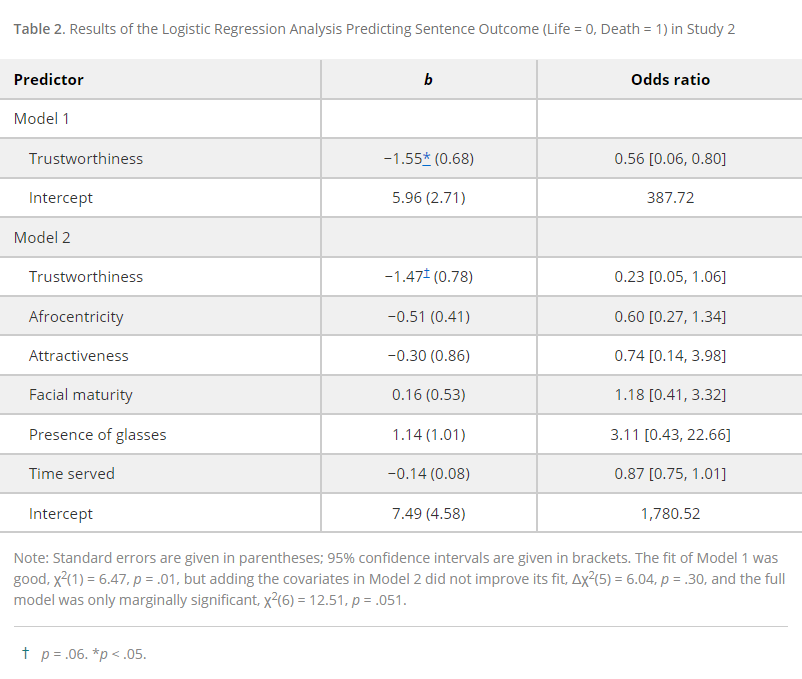

```{r setup, include=FALSE}
knitr::opts_chunk$set(echo = TRUE)
library(knitr)
```

## Introduction

In the article Facial Trustworthiness Predicts Extreme Criminal-Sentencing Outcomes by John Paul Wilson and Nicholas O. Rule, an experiment is done to see if people's perception of trustworthiness in criminals could be a good predictor for extreme criminal-sentencing outcomes. In order to make the study valid, they wanted to do this with actual murderers, instead of just running an experiment with perceived guilt. The goal was to see if people giving a trust rating to each of these people was relevant. In the first study, people were shown murderers and asked to rate them on trustworthiness on a scale from 1 to 8. In the second study, the same people were shown people who were exonerated from death row. It was hypothesized that the results would show that these ratings would have a correlation to extreme criminal sentencing outcomes.

In the first study, photos of inmates were collected from the Florida Department Corrections. These are people who were convicted of murder and are now waiting on death row. Females were excluded as well as males who were not black or white, which left them with 371 men. They then selected a control group of similar looking men who had life in prison, resulting in a total of 742 images that were then divided into 7 smaller sets. After, 208 workers from Amazon Mechanical Turk who were all American were then asked to rate these photos on how trustworthy they assumed they were on a scale from 1 to 8 with 1 being not trustworthy and 8 being extremely trustworthy. Other samples were also taken to rate the subjects in the photos based on Afrocentricity, attractiveness and facial maturity. Some other factors that were also taken into account were fWHR (facial width to height ratio), presence of glasses, and presence of tattoos. In the second study, photos were collected from the innocence project of people who have been exonerated from their crimes. From those, 37 men were selected whose crimes would’ve either landed them on death row or life in prison. The same group of workers was then brought in to rate these photos using the same traits as study one, while also factoring in how many years the person spent in prison.

For the results for study 1, all of the ratings were averaged out in order to get a group judgment for each rating for each face. It was found that subjects who were sentenced to death looked less trustworthy than those who were sentenced to life in prison. Black subjects were also rated more trustworthy than white targets, but race and sentence did not interact. A logistic regression model was then built to see the extent that facial trustworthiness would predict the sentencing outcomes as well as with the other traits that were measured. It was determined that targets who were seen as less trustworthy had a higher likelihood to be sentenced to death than people who were seen as more trustworthy. Trustworthiness did seem to be a good predictor, but Afrocentricity, fWHR and glasses were also significant. In the second study, another logistic regression model was built. Again, it was found that trustworthiness did a good job predicting sentencing outcomes. In this model, none of the covariates predicted death sentencing. The final results after both of the studies concluded were that facial appearance really does affect criminal sentencing independent of actual guilt, and also the severity of the sentence. Overall, this points out a problem in the criminal-justice system that they need to be made aware of, or bias on the grounds of facial features will continue to have an impact on sentencing.

The goals of our report are to replicate the data that was produced by the experiment in both study 1 and study 2. Each of these studies has two models within them that account for all of the characteristics that have been previously listed. We will be doing this by creating two binary logistic regression models for each study, and then displaying the data using the summary function. The results of both of the studies that are predicting sentencing outcomes will be shown, which should match those that were given in the article.


## Methods

There was one primary methodology to analyze the relationship between facial trustworthiness and actual criminal sentences across two studies. Both studies involved the gathering of faces of convicted murderers who had been sentenced to either death or life in prison.

### Study 1

In Study 1, the facial trustworthiness of every death-row inmate in Florida was analyzed in order to investigate the relationship between facial trustworthiness and sentencing among real criminals serving life sentences or awaiting execution. Stimulus selection was utilized as 376 white and black males were selected, excluding female inmates and inmates of other races. This was done in order to keep sex and race uniform. A control group of inmates sentenced to life imprisonment was selected to compare against death row inmates.

Next, in order to collect data on the facial traits of the inmates, defendants were divided into seven sets, each set containing equal life sentences and death row sentences, as well as racial splits. They obtained trustworthiness ratings by asking 208 American workers from Amazon Mechanical Turk to rate their trustworthiness from 1 to 8. Ratings of other facial traits were collected, indluding Afrocentricity, attractiveness, facial maturity, glasses, and tattoos. These trustworthiness ratings were compared to a facial width-to-height ratio (fWHR) rating (aggression rating) using ImageJ, and there was a small negative correlation between them, suggesting an independent relationship.

Two logistic regression models were used in order to determine the relationship of facial trustworthiness and predicted sentencing outcomes. The first regressed sentence outcome (0 = life, 1 = death) onto trustworthiness. The second added more covariates in addition to trustworthiness. The covariates were Afrocentricity, attractiveness, facial maturity, fWHR, presence of glasses, and presence of tattoos.

To reproduce the two models, we will use the `glm()` R function with the `family=binomial` parameter to create binary logistic regression models that regress sentence outcome onto the corresponding covariates for each model.

### Study 2

Study 2 tested the relationship between perceived trustworthiness and criminal sentencing among innocent individuals. Stimulus selection was utilized to select from a group of 107 people. They recorded information such as the sentence received, length of time served, crime committed, year of conviction, and state the conviction occurred. They eliminated people who lived in a state without a death sentence, and selected people whose crimes would have made them eligible for the death sentence. This resulted in a total of 37 people, 20 of whom sentenced to life and 17 to death.

American workers from the Amazon Mechanical Turk were again asked to rate each of the 37 people for trustworthiness, Afrocentricity, attractiveness, and facial maturity. These were the same scales as Study 1. Presence of glasses and tattoos were coded for but fWHR (aggression) was unable to be recorded because targets were not uniformly facing the camera.

Two logistic regression models were used in order to determine if facial trustworthiness predicted sentencing outcomes for innocent individuals. The first regressed sentence outcome (0 = life, 1 = death) onto trustworthiness. The second added more covariates in addition to trustworthiness. The covariates were Afrocentricity, attractiveness, facial maturity, the presence of glasses, and the number of years each person served in prison.

To reproduce the two models, we will use the `glm()` R function with the `family=binomial` parameter to create binary logistic regression models that regress sentence outcome onto the corresponding covariates for each model.

## Results

First, we import the two datasets needed for the two studies. `study1` is the dataset used for Study 1, and `study2` is the dataset used for Study 2.
```{r}
study1 = read.csv("Study1Data.csv")
study2 = read.csv("Study2Data.csv")
```

### Study 1

Study 1 has two binary logistic regression models, Model 1 and Model 2. We were able to reproduce Model 1 and Model 2 in terms of coefficients and odds ratios as presented in Table 1.

```{r, echo=FALSE}

```

#### Model 1

The results of Model 1 show that convicted murderers perceived as less trustworthy were more likely to be sentenced to death since the coefficient of `Trustworthiness` is negative.

```{r}
s1mod1 = glm(sent ~ trust, family=binomial, data=study1)
summary(s1mod1)
b = coef(s1mod1)
names(b) = c("Intercept", "Trustworthiness")
odds.ratio = exp(b)
s1mod1.df = as.data.frame(cbind(b, odds.ratio))
kable(s1mod1.df)
```

#### Model 2

The results of Model 2 show that faces perceived as less trustworthy were more likely to be sentenced to death since the coefficient of `Trustworthiness` is negative. Afrocentricity was negatively associated with the death sentence, and fWHR and the presence of glasses were positively associated with the death sentence.

```{r}
s1mod2 = glm(sent ~ trust + zAfro + attract + maturity + zfWHR + glasses + tattoos, family=binomial, data=study1)
summary(s1mod2)
b = coef(s1mod2)
names(b) = c("Intercept", "Trustworthiness", "Afrocentricity", "Attractiveness", "Facial maturity", "Facial width-to-height ratio", "Presence of glasses", "Presence of tattoos")
odds.ratio = exp(b)
s1mod2.df = as.data.frame(cbind(b, odds.ratio))
kable(s1mod2.df)
```

### Study 2

Study 2 has two binary logistic regression models, Model 1 and Model 2. We were able to reproduce Model 1 and Model 2 in terms of coefficients and odds ratios as presented in Table 2. For Model 1, the summary table in the paper displayed the odds ratio of `Trustworthiness` as 0.56, which seems to be a typo, when it was actually 0.21 as stated in the preceding paragraph. We, however, did obtain an odds ratio of 0.21 for `Trustworthiness` in our reproduction of Model 1.

```{r, echo=FALSE}

```

#### Model 1

The results of Model 1 show that faces perceived as less trustworthy were more likely to be sentenced to death since the coefficient of `Trustworthiness` is negative.

```{r}
s2mod1 = glm(sent ~ trust, family=binomial, data=study2)
summary(s2mod1)
b = coef(s2mod1)
names(b) = c("Intercept", "Trustworthiness")
odds.ratio = exp(b)
s2mod1.df = as.data.frame(cbind(b, odds.ratio))
kable(s2mod1.df)
```

#### Model 2

In Model 2, adding the additional covariates did not improve the previous model (Model 1), and none of the covariates predicted the death sentence. However, `Trustworthiness` still remained the predictor that had an continuous effect on the death sentence.

```{r}
s2mod2 = glm(sent ~ trust + zAfro + attract + maturity + glasses + served, family=binomial, data=study2)
summary(s2mod2)
b = coef(s2mod2)
names(b) = c("Intercept", "Trustworthiness", "Afrocentricity", "Attractiveness", "Facial maturity", "Presence of glasses", "Time served")
odds.ratio = exp(b)
s2mod2.df = as.data.frame(cbind(b, odds.ratio))
kable(s2mod2.df)
```

     
### Commentary

```{r}
# Study 1 Plots
s1mod1.fits <- fitted(s1mod1)
s1mod1.dev.resids <- resid(s1mod1)
par(mfrow=c(1,2), cex =0.45, mar = c(4,4,2.3,0.2), bty ="L")
plot(s1mod1.fits, s1mod1.dev.resids, xlab = " Fitted Values ", ylab = " Deviance Residuals", main =  "Study 1 Model 1")
abline(h=0, lty=2)
qqnorm(s1mod1.dev.resids, xlab = "Std, Normal Quantities", ylab = "Deviance Residuals", main = "Study 1 Model 1")
qqline(s1mod1.dev.resids)

s1mod2.fits <- fitted(s1mod2)
s1mod2.dev.resids <- resid(s1mod2)
par(mfrow=c(1,2), cex =0.45, mar = c(4,4,2.3,0.2), bty ="L")
plot(s1mod2.fits, s1mod2.dev.resids, xlab = " Fitted Values ", ylab = " Deviance Residuals", main =  "Study 1 Model 2")
abline(h=0, lty=2)
qqnorm(s1mod2.dev.resids, xlab = "Std, Normal Quantities", ylab = "Deviance Residuals", main = "Study 1 Model 2")
qqline(s1mod2.dev.resids)

# Study 2 Plots 
s2mod1.fits <- fitted(s2mod1)
s2mod1.dev.resids <- resid(s2mod1)
par(mfrow=c(1,2), cex =0.45, mar = c(4,4,2.3,0.2), bty ="L")
plot(s2mod1.fits, s2mod1.dev.resids, xlab = " Fitted Values ", ylab = " Deviance Residuals", main =  "Study 2 Model 1")
abline(h=0, lty=2)
qqnorm(s2mod1.dev.resids, xlab = "Std, Normal Quantities", ylab = "Deviance Residuals", main = "Study 2 Model 1")
qqline(s2mod1.dev.resids)

s2mod2.fits <- fitted(s2mod2)
s2mod2.dev.resids <- resid(s2mod2)
par(mfrow=c(1,2), cex =0.45, mar = c(2,2,2.3,0.2), bty ="L")
plot(s2mod2.fits, s2mod2.dev.resids, xlab = " Fitted Values ", ylab = " Deviance Residuals", main =  "Study 2 Model 2")
abline(h=0, lty=2)
qqnorm(s2mod2.dev.resids, xlab = "Std, Normal Quantities", ylab = "Deviance Residuals", main = "Study 2 Model 2")
qqline(s2mod2.dev.resids)

```
    
For both studies, a binary logistic model was used. This seemed appropriate since the dependent variable, the sentence outcome, is binary with 0 = life and 1 = death. Our group was able to reproduce almost the exact same results as the study. However, when looking at goodness of fit for the binary logistic regression model it appears the model is not well fitted. When looking at the Deviance vs. Fitted value graphs the data is not randomly scattered around 0, and the deviance residuals do not appear to be normally distributed. This could be due to how it appears that the researchers in the study did not make sure the assumptions of the binary logistic regression model were met before fitting the data. In this study, the probability of getting the life sentence is not constant from inmate to inmate, since that probability depends on the severity of their crime. 

The papers final results for study 1 resulted in a 95% CI odds ratio of [0.54,.91] and I think it should have been mentioned that the confidence interval contained .91 which is pretty close to 1 and indicates there is no relationship between trustworthiness and sentencing results. Not to mention the 2nd study's CI for the odds ratio (.05, 1.06) did contain one indicating trustworthiness did not effect sentencing. Considering this, I do not think concluding that untrustworthy faces are more likely to be sentenced to death was appropriate. 